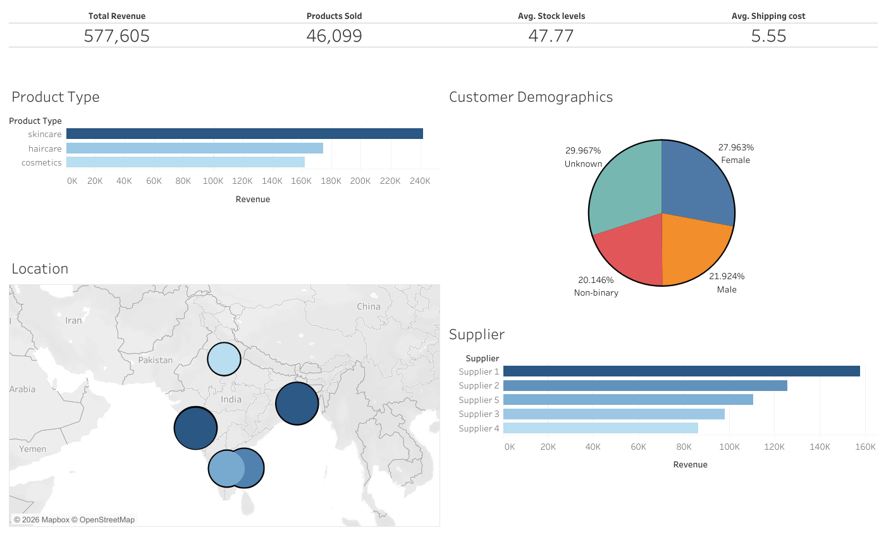
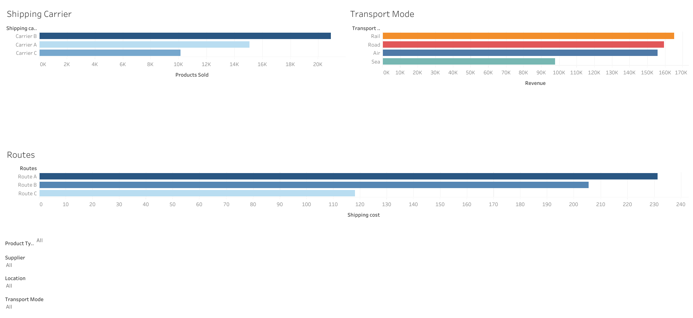

# supply-chain-analytics-tableau

## 📌 Ringkasan Proyek
Proyek ini menyajikan dashboard Tableau interaktif untuk menganalisis kinerja rantai pasok (*supply chain*), metrik komersial, dan operasi logistik. Tujuan dari proyek ini adalah memberikan wawasan (*insights*) yang dapat ditindaklanjuti mengenai faktor pendorong pendapatan, kinerja pemasok, dan efisiensi pengiriman guna membantu para pemangku kepentingan dalam membuat keputusan berbasis data.

## 📊 Dashboard

### 1. Ringkasan Eksekutif
Berfokus pada KPI tingkat tinggi, pendapatan berdasarkan jenis produk, pemasok teratas, dan demografi pelanggan untuk memberikan ringkasan cepat bagi pimpinan perusahaan.



### 2. Logistik & Operasional
Berfokus pada metrik operasional seperti jasa pengiriman (*shipping carrier*), moda transportasi, dan biaya rute untuk membantu tim operasional dalam mengoptimalkan logistik.



## 🔗 Tautan Dashboard
**[Lihat Dashboard Interaktif di Tableau Public]
(https://public.tableau.com/shared/P4X326HKZ?:display_count=n&:origin=viz_share_link
https://public.tableau.com/views/LogisticsOperationsDashboard_17827015433220/LogisticsOperations?:language=en-US&:sid=&:redirect=auth&:display_count=n&:origin=viz_share_link)**

## 🛠️ Alat yang Digunakan
- **Visualisasi Data & Analitik:** Tableau Public
- **Persiapan Data:** Microsoft Excel

## 📂 Struktur Repositori
```text
Supply-Chain-Analytics/
├── dashboard/
│   ├── Logistics & Operations Dashboard.twbx
│   └── Supply Chain Executive Dashboard.twbx
├── dataset/
│   └── supply_chain_data.csv
├── images/
│   ├── executive_dashboard.png
│   └── logistics_dashboard.png
└── README.md
